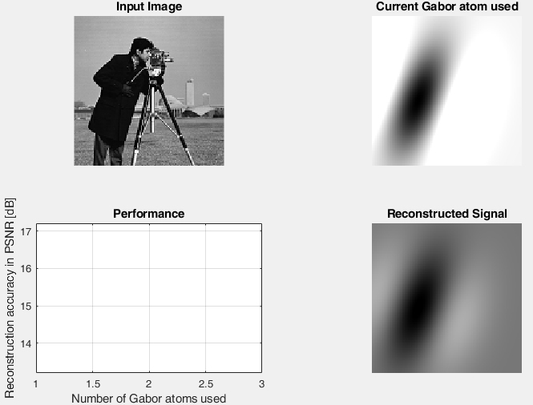

# MP2_DMS_PSO
MATLAB implementation of the image sparse decomposition algorithm (based on matching pursuit with PSO optimization).

## Example

## References: 
[1] C. Chen, J.J. Liang, B.Y. Qu, and B. Niu, "Using Dynamic Multi-Swarm Particle Swarm Optimizer to Improve the Image Sparse Decomposition Based on Matching Pursuit," ICIC 2013, LNAI 7996, pp. 587–595, 2013.

[2] Liang, J.J.; Suganthan, P.N., "Dynamic multi-swarm particle swarm optimizer," Swarm Intelligence Symposium, 2005. SIS 2005. Proceedings 2005 IEEE , vol., no., pp.124,129, 8-10 June 2005, doi: 10.1109/SIS.2005.1501611
